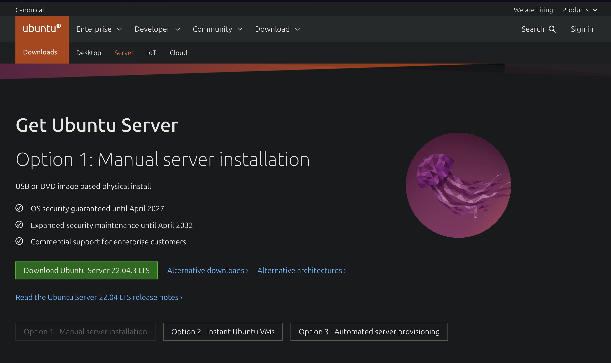
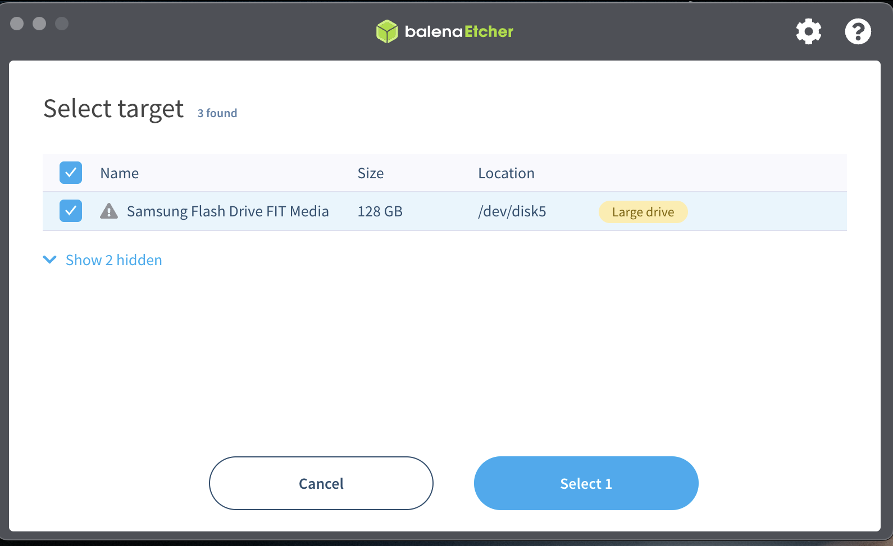

# 🛣 The Node Less Traveled By: The Road to Ethereum Independence

## Phase 1: Hardware

<figure><figcaption>
All of our boxed components
</figcaption></figure>

### Gather the Things

Pictured above are the hardware components needed to setup our node:


It's okay if your specific components don't look like what's pictured above, the important thing is you have one of each: a SSD, RAM, and a computer to run the node


* The black box in the top left is called an NVME SSD
  * You may already be familiar with an SSD, it's commonly known as a "hard drive"
  * This SSD is where all the data for our node is going to be stored, from the actual operating system to each block our node receives as part of the blockchain
* Below it, in the bottom left, is our RAM which is also called "memory"
  * RAM is used by our computer to hold information that doesn't need to be permanently stored on the SSD
    * For example, the actual software we're going to be running for syncing the blockchain is going to be loaded into memory while it's running
* The big box to the right is our Intel NUC, the actual computer that's going to be running the node software to sync us with the blockchain

Aside from what's pictured above, we need two more items: A small screwdriver and at least a 32 GB USB

<figure><figcaption>
A USB and a small screwdriver
</figcaption></figure>

### Unbox the Things

#### The Intel NUC

<figure><figcaption>
This is everything included in the box
</figcaption></figure>

Starting with the Intel NUC, let's go over everything included in the box (ignoring the actual box 😉):

* All the way to the left is a black metal plate
  * This plate is would allow you to mount the Intel NUC onto the back of a computer monitor that supports [VESA mounting](https://www.ergotron.com/en-us/support/vesa-standard)
* In the middle is our Intel NUC
* To the top right of the NUC is what I believe is a standoff screw, but it's not mentioned in the included manual and I'm not sure where it even goes. It's okay though, we're not going to use it 🙂
* To the bottom right of the NUC are some extra screw that I believe are for mounting the NUC to the back of a computer monitor using the included metal plate
* In the top right is our power supply used to power the NUC
* And below it is our standard instruction manual and safety precautions

For this guide you can ignore everything but the NUC and the power supply:

<figure><figcaption>
Our Intel NUC and our power supply
</figcaption></figure>

#### The RAM

<figure><figcaption>
Our RAM (a.k.a. memory)
</figcaption></figure>

Your exact RAM packaging may differ, but this one is pretty nonsense and only contains two RAM sticks


You may only have a single RAM stick and that's fine. Pictured below are two 16 GB sticks of RAM, but they come in various configurations e.g. one stick that's 32 GB, one stick that's 64 GB, etc.


<figure><figcaption>
Two 16 GB sticks of RAM
</figcaption></figure>

#### The SSD

<figure><figcaption>
Our NVME SSD
</figcaption></figure>

Your SSD packaging may also differ, but it's probably going to contain the same as pictured below:

<figure><figcaption>
Our opened NVME SSD
</figcaption></figure>

Included in the box is:

* In the top left is the standard manufacture disclosures
* In the bottom left is the NVME SSD

#### All the Unboxed Things

<figure><figcaption>
All of our unboxed components: NVME SSD, two sticks of RAM, the Intel NUC, and it's power supply
</figcaption></figure>

### Assemble the Things

#### Opening Up the NUC

The first step in assembling our node is to unscrew the bottom cover of the NUC. Pictured below is the bottom of the NUC with the four screws we need to unscrew highlighted by the red squares:


**Note:** The four screw are _captured,_ meaning they're not going to come out of their holes no matter how much you unscrew them. When they become loose and you can move the screw up and down, that's how you'll know it's completely unscrewed


<figure><figcaption>
Unscrew the four highlighted screws to remove the bottom cover of the NUC
</figcaption></figure>


**Note:** We're going to remove the bottom cover of the NUC, but **be careful** when you do so because there is a _ribbon cable_ attached to the bottom cover (see the below image to see what this ribbon cable looks like) that you don't want to accidentally rip apart if you remove the bottom cover a bit too vigorously 💪&#x20;

The first time you remove this bottom cover, it might be _a bit_ stiff so it might require just a _little bit_ of _umph -_ You'll figure it out though, I believe in you 🙂 (plus we don't use the ribbon cable, so if you accidentally damage it, it's not the end of your node)


Next we're going to open up the NUC by removing the bottom cover. To do so, hold onto the NUC with one hand and pull up using one of the screw with the other hand. Once you seperate the bottom cover from the rest of the NUC, carefully place it off to the side like so:

<figure><figcaption>
An opened up NUC
</figcaption></figure>

#### Installing the RAM

<figure><figcaption>
The RAM slots highlighted by a red rectangle
</figcaption></figure>

Highlighted in the above image are the slots we're going to insert our RAM into. This part is going to _feel_ like you're going to break something, but it does require _a little bit_ of effort to full push the RAM into it's slot. You're also going to be inserting the RAM at a _slight_ angle and then you'll push it down into the silver bracket (highlighted in the below image) that'll hold the stick of RAM on it's sides

Insert the **gold side** of the first stick (or your only stick if you only have one stick) of RAM into the **bottom** slot. The **gold side** of the RAM will have a small section missing from it, this gap lines up with a solid piece in the slot we're sticking the RAM into. Make sure your stick of RAM is correctly orientated and the gap in the stick lines up with the solid piece in the slot before trying to push the stick into the slot (otherwise you'll damage the stick of RAM)

Once you've inserted the stick of RAM, it'll look like:

<figure><figcaption>
The first slotted stick of RAM, highlighted is the bracket that holds the stick of RAM by it's sides
</figcaption></figure>

If you have a second stick of RAM, insert it in the top slot same as you did the first one (also making sure to push down slightly on the stick to push in into the bracket):

<figure><figcaption>
The second stick of RAM slotted into it's place
</figcaption></figure>

#### Installing the SSD

<figure><figcaption>
The SSD slot highlighted by a red rectangle
</figcaption></figure>

Next, and the last step before we close up the NUC, we're installing our SSD. To do so, there's a small screw we need to remove first - I've highlighted the screw in the above image, please completely unscrew it and set it off to the side

After completely removing the screw, insert your SSD **gold side** first into it's slot. Like the RAM, there's a small gap in the **gold side** that aligns with a solid piece in the slot. Please make sure you're lining up the gap with the solid piece before trying to insert the SSD

<figure><figcaption>
The SSD inserted into it's slot
</figcaption></figure>

As you can see in the above picture, the SSD is going to be at a weird angle after inserting and that's completely fine. The tiny screw we removed is going to hold down the SSD

Please reinsert the tiny screw into it's hole, making sure it's holding down the SSD by the **gold half circle** that lines up with the screw hole. After reinserting the screw, it should look like:

<figure><figcaption>
A NUC with the RAM and SSD slotted into their places
</figcaption></figure>

#### Batten Down the Hatches

Now that we've installed the RAM and the SSD, it's time to screw the bottom cover back on, completing our assembly of our node, congrats 🎉

## Phase 2: Operating System

Now that we've assembled the hardware, it's time to finish turning it into a computer by installing an operating system (sometimes abbreviated as OS). As is, if you purchased the barebones model, your NUC doesn't have an operating system. If you're unfamiliar with the term, the operating system is what you're most likely heard as "Windows", "MacOS", or maybe you've even heard of "Linux". Your OS is what allows you to use software with your hardware, without it your NUC is just a box that doesn't do much besides turn on

### Gather More Things

To install your OS, you're going to need the following

* A computer (aside from our NUC 😉)
* A USB with at least 16 GB of space
  * **Note:** All of the data on the USB is going to be erased, please use a new USB or one that doesn't contain **any** data you care about
* A display to connect your NUC to
* An HDMI cable
* A keyboard

### Downloading the OS

For our NUC, we're going to be using a Linux operating system, specifically we're going to be using the Ubuntu Server [distribution](https://www.suse.com/suse-defines/definition/linux-distribution/) (for an explainer on why we're choosing Linux, please refer to [this](https://www.logicmonitor.com/blog/9-reasons-linux-is-a-popular-choice-for-servers), or feel free to search "Why use Linux for servers")

Because Linux is open source software, it's actually free to download and free to use :tada: We're going to download a file called an [ISO](https://www.geeksforgeeks.org/iso-full-form/) from the official Ubuntu website's [download page](https://ubuntu.com/download/server):


Depending on when you are viewing this guide, the Ubuntu download page make look different from what's pictured below, regardless, there should be a big download button somewhere\
\
It's also okay if the version number when you download Ubuntu Server is different from what's shown below (version `22.04.3`)


<figure><figcaption>
The Ubuntu Server download page
</figcaption></figure>

If you haven't already, go ahead and click the big green button to download the Ubuntu Service ISO (it may take a while to download)

### Flashing Our USB

In order to install the operating system onto our NUC, we're going to need a way to install the Ubuntu Server ISO you just downloaded onto our NUC - this is where that USB comes in

Now just transferring the Ubuntu Server ISO file onto the USB isn't enough, we need to _flash_ the ISO onto the USB so that when we plug it into our NUC, it can recognize it as an operating system it can run on it's hardware

#### Installing Etcher

To do this, we're going to download a program called [balenaEtcher](https://etcher.balena.io/#download-etcher), another free piece of useful software. Once again, go ahead and click the big green button to download it

<figure><figcaption>
The balenaEtcher download page
</figcaption></figure>

After clicking the download button if you see the below screen:

<figure><figcaption>
The download section for Etcher
</figcaption></figure>

Go ahead and click the `Download` link that corresponds to the operating system of the computer you're currently using. If you're using Windows, it'll be the very first `Download`, if you're using MacOS it'll be the 4th from the top, and for Linux the 2nd to last

Depending on your OS, installing Etcher is going to look a little different. I'm writing this guide on a macbook, so below is the installation process for MacOS, but regardless the installtion process should be pretty similar

#### Installing Etcher on MacOS

When you clicked the `Download` button for Etcher, you downloaded a `.dmg` file. You've probably already gone through the process of installing apps downloaded from the web on your Mac already, but just incase you haven't, double click the downloaded file and you should see the screen:

<figure><figcaption>
The balenaEtcher installer
</figcaption></figure>

Then click on the balenaEtcher app and drag it into the `Applications` folder as depicted by the arrow, then you can close this screen

Next, launch the balenaEtcher app by opening up `Spotlight search` by pressing and holding the `⌘` key on your keyboard and the `Space bar`. Then type in `etcher` like so and press the `return` key to launch the app:

<figure><figcaption>
Spolight search for Etcher
</figcaption></figure>

If you see the following pop-up, click `Open`:

<figure><figcaption>
MacOs secuirty warning
</figcaption></figure>

#### The Balena Etcher App

Regardless of your OS, you should after installing Etcher and opening the app, you should something similar to:

<figure><figcaption>
The Balena Etcher app
</figcaption></figure>

Now we're going to _flash_ our downloaded ISO file onto our USB by clicking the blue `Flash from file` button. Upon clicking, your OS's file picker should popup:

<figure><figcaption></figcaption></figure>

Go ahead and navigate to where you downloaded the Ubuntu Server ISO file (mostly likely this will be your OS's `Downloads` folder), click the ISO file, and click the `open` button in the bottom right. Afterwards you should see the `Select Target` button turn to blue:

<figure><figcaption>
Etcher select target
</figcaption></figure>

Before continuing, plug in the USB you want flash the OS onto into your computer. Afterwards, click the blue `Select target` button and you should see a screen similar to:

<figure><figcaption>
Etcher target picker
</figcaption></figure>


It is **very** important you take your time to verify you're selecting the USB you intended to **completely erase all data on** to flash the OS on this screen. Even if you only see one device listed (as pictured above), try unplugging the USB from your computer and verify the device disappears from the selection screen, then plug the device back in and verify the device that reappears is the USB you intend on using


<figure><figcaption>
An empty target picker because I unplugged my USB
</figcaption></figure>

<figure><figcaption>
My USB reappearing in the target picker after plugging it back in
</figcaption></figure>

Once you're 100% sure you know which target on this screen is the USB you'd like to use, go ahead and select it:

<figure><figcaption>
Etcher with the USB selected
</figcaption></figure>

Then click the blue `Select 1` button and you should see:

<figure><figcaption>
Etcher ready to flash our USB
</figcaption></figure>


Before clicking the blue `Flash!` button, be 100% sure you're ready to **erase all the data on your USB**. Once you click the blue `Flash!`button, all of the data on the USB will be permanetly erased


Once you're ready, click the blue `Flash!`button to begin flashing the Ubuntu Server ISO onto your USB

#### If you're on MacOS, you may see the following popups:

This first one is just MacOS asking you to verify you want to give balenaEtcher access to write to your USB. Enter your password and click the `Ok` button

<figure><figcaption>
balenaEtcher asking for permission to write to your USB
</figcaption></figure>

The next popup is also confirming you want to give balenaEtcher access to write to your USB. Click the `OK` button

<figure><figcaption>
balenaEtcher asking for permission to access your USB
</figcaption></figure>


You _may_ see the following scren if you're using a USB with a lot of storage. If you sure you want to erase everything on your USB, click the `Yes, I'm sure` text to continue


<figure><figcaption>
Etcher larger target confirmation
</figcaption></figure>

You should see Etcher begin to flash the ISO onto your USB:

<figure><figcaption>
Etcher flashing ISO onto USB
</figcaption></figure>

When the flashing process reaches 100%, Etcher will begin to validate the ISO was flashed correctly onto your USB:

<figure><figcaption>
Etcher validating ISO was flashed correctly
</figcaption></figure>

When you see this screen, you have successfully flashed the Ubuntu Server ISO onto
