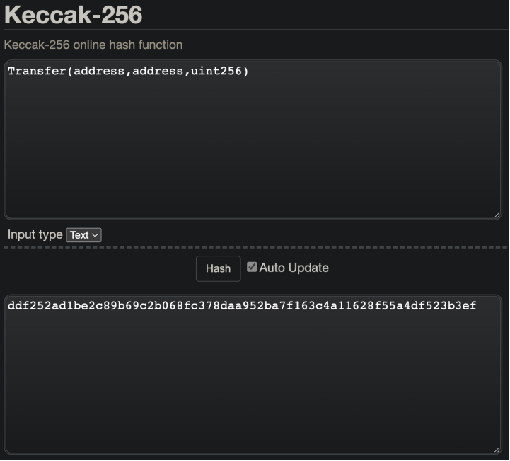
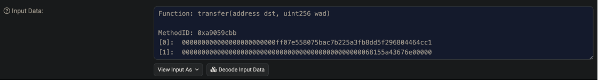
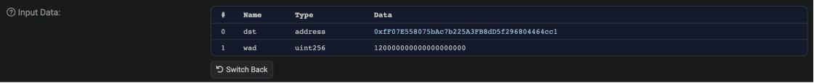
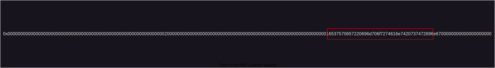
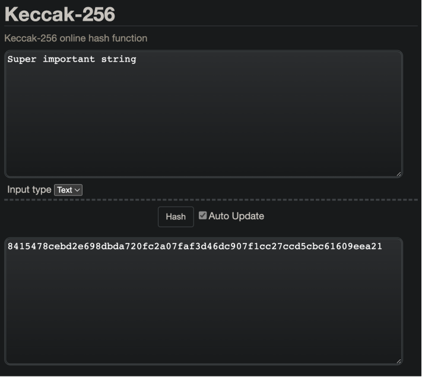
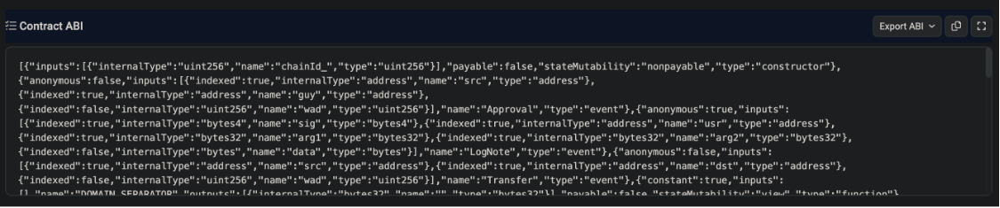

# 📄 The Solidity Events Guide I Wish I Had

> Welcome to the grand odyssey of Web3, a journey from the familiar shores of Web2 towards the vast ocean of the Ethereum blockchain. Web2, the mainland we've known and navigated for years, is brimming with data cities and information highways. But an exciting adventure beckons us beyond, towards the open sea of decentralization.
>
> Our vessels in this voyage are nodes, sturdy ships that bear the responsibility of carrying supplies across the deep, uncharted waters. These supplies, cryptographic blocks of data and instructions, are destined for the islands, the scattered archipelago of smart contracts, each an autonomous paradise operating under its own rules and logic.
>
> On these islands, tireless robotic workers, algorithms encapsulated within the smart contracts, receive the supplies. With meticulous precision, they use these supplies to construct, verify, and enforce a diverse array of creations, from self-executing agreements to entire decentralized applications.
>
> Yet, how does the mainland stay informed of the activities taking place on these far-off islands? Enter Solidity events. Like messages encapsulated in a bottle, these events carry vital progress reports and significant updates. Once created by the contract robots, they are picked up by the passing node-ships and carried back across the Ethereum ocean, back to the eagerly awaiting inhabitants of the mainland.
>
> So, join us as we set sail into the open sea of the Ethereum blockchain, guided by the stars of Solidity events, exploring the intriguing islands of smart contracts and charting a course towards the thrilling future of decentralization.

\~ ChatGPT

Ethereum is a world computer where each node in the network is running an implementation of it's code, and the Ethereum blockchain is the collective agreement of these nodes on what the latest state of the machine is. One key component of the Ethereum computer that is necessary for this consensus of the latest state to be possible is, _deterministic state updates_. Because Ethereum aims to be decentralized, each node in the network must be able to process the transactions in a new block and have the same resulting latest state as all the other nodes in the network. One of the reasons this can be achieved, is because the Ethereum computer (i.e. the Ethereum Virtual Machine) is _sandboxed_. This sandboxing means the EVM is limited in capability, so that given a set of inputs, there can only be one output. This is how each node executing the latest transactions can all arrive at the same latest state of the blockchain.

While the deterministic state updates are ideal for achieving consensus, there are some tradeoffs that create unique challenges when combing the worlds of Web2 and Ethereum. One of those limitations is how an Ethereum smart contract can communicate with the world that exists outside of the sandboxed virtual machine all Ethereum smart contract exist in. Part of the reason for this limitation is the indeterministic nature of making a call from the EVM to the outside world. Imagine you had a smart contract that made an API requests to a web API to get the latest price for a pair of assets. When Node A processes a transaction that triggers this API call, it receives a response of `42` and updates it's latest state accordingly. Then when Node B processes the same transaction, the price has changed so it receives a response of `40`, and updates it's latest state accordingly. Then Node C makes the request and receives a `404` HTTP response because the API went offline for a second, how does Node C even update it's state then? Regardless, you can see the bigger issue that a call from the EVM to the world outside of it's sandbox may not always produce the same response. If this was allowed, how is the Ethereum world computer supposed to reach consensus on what the latest state should be when every node in the network could possibly have a different view of the latest state?

To help solve this issue of communication between Web2 and Ethereum, the EVM has allowed for the generation of **logs**. In Solidity we make use of these logs by emitting **events**.

***

### Table of Contents

* [Logging in Ethereum](the-solidity-events-guide-i-wish-i-had.md#logging-in-ethereum)
* [Ethereum Log Topics](the-solidity-events-guide-i-wish-i-had.md#ethereum-log-topics)
  * [Named Events](the-solidity-events-guide-i-wish-i-had.md#named-events)
    * [Event Signature](the-solidity-events-guide-i-wish-i-had.md#event-signature)
  * [Remaining Event Topics](the-solidity-events-guide-i-wish-i-had.md#remaining-event-topics)
    * [And What About the Missing `wad` Parameter?](the-solidity-events-guide-i-wish-i-had.md#and-what-about-the-missing-wad-parameter)
  * [Anonymous Events](the-solidity-events-guide-i-wish-i-had.md#anonymous-events)
    * [Use Cases](the-solidity-events-guide-i-wish-i-had.md#use-cases)
      * [Additional Custom Indexed Parameter](the-solidity-events-guide-i-wish-i-had.md#additional-custom-indexed-parameter)
      * [Gas Savings](the-solidity-events-guide-i-wish-i-had.md#gas-savings)
      * [Obfuscation](the-solidity-events-guide-i-wish-i-had.md#obfuscation)
    * [Caveats](the-solidity-events-guide-i-wish-i-had.md#caveats)
      * [Difficulty Filtering Transactions](the-solidity-events-guide-i-wish-i-had.md#difficulty-filtering-transactions)
      * [Event Impersonation](the-solidity-events-guide-i-wish-i-had.md#event-impersonation)
  * [What Happened to My `indexed` String?](the-solidity-events-guide-i-wish-i-had.md#what-happened-to-my-indexed-string)
    * [An Aside About ABI Encoding](the-solidity-events-guide-i-wish-i-had.md#an-aside-about-abi-encoding)
    * [Why So Much Data to Represent our `22` Byte String?](the-solidity-events-guide-i-wish-i-had.md#why-so-much-data-to-represent-our-22-byte-string)
    * [What Actually Happens to `indexed` Strings](the-solidity-events-guide-i-wish-i-had.md#what-actually-happens-to-indexed-strings)
    * [The Caveat of Using `indexed` Strings](the-solidity-events-guide-i-wish-i-had.md#the-caveat-of-using-indexed-strings)
* [Event Data](the-solidity-events-guide-i-wish-i-had.md#event-data)
  * [Emitting No Data](the-solidity-events-guide-i-wish-i-had.md#emitting-no-data)
  * [Emitting Values Types](the-solidity-events-guide-i-wish-i-had.md#emitting-values-types)
  * [Emitting Reference Types](the-solidity-events-guide-i-wish-i-had.md#emitting-reference-types)
  * [Emitting Value and Reference Types](the-solidity-events-guide-i-wish-i-had.md#emitting-value-and-reference-types)
* [Retrieving Past DAI Transfer Event Logs Using Web3.js](the-solidity-events-guide-i-wish-i-had.md#retrieving-past-dai-transfer-event-logs-using-web3.js)
* [Listening to New DAI Transfer Events Using Web3.js](the-solidity-events-guide-i-wish-i-had.md#listening-to-new-dai-transfer-events-using-web3.js)
* [Listening to Your Contract's Events Using Web3.js](the-solidity-events-guide-i-wish-i-had.md#listening-to-your-contracts-events-using-web3.js)
* [References](the-solidity-events-guide-i-wish-i-had.md#references)

***

### Logging in Ethereum

Under the hood, emitting events in Solidity instructs the EVM to execute one of the following opcodes: `LOG0`, `LOG1`, `LOG2`, `LOG3`, or `LOG4` (You can view their details [here](https://www.evm.codes/#a0?fork=shanghai)). When an event is emitted, the `LOG` opcode generates a log entry that includes the address of the contract that emitted the event, an array of topics, and some amount of data. Topics come from `indexed` parameters of the event, and each `LOG` opcode has a corresponding number that denotes the number of topics it can handle (from 0 - 4). The `data` property of the log comes from non-indexed event parameters, and the restrictions of how much data can be logged are the **gas cost** of storing the data (currently 8 gas for each byte of data + some other values shown in the images below), and the **block's gas limit** (even if you were willing to pay for a lot of gas to be used to store your data, it is very possible that your transaction can exceed the total amount of gas allowed to be used in the current block - especially when you consider your transaction may not be the only transaction using the block's gas allowance).

<figure><figcaption><p>LOG EVM Opcode Documentation</p></figcaption></figure>

When a `LOG` instruction is executed, the generated log entry is stored in the transaction context within the EVM, this is a temporary space used by the EVM to process a transaction before it's finalized. This transaction context holds information about the transaction currently being processed, including any changes made to the state, and any log entries generated. Once the transaction has been processed by the EVM and is ready to be included in the blockchain, a transaction receipt is created. This receipt is a summary of the transaction's execution, including the status, gas used, and logs generated.

Below is an example of a transaction receipt, some data has been omitted for brevity, but you can view the whole receipt [here](https://etherscan.io/tx/0x81b886145c37afe0e42353e81f8f2896dd69fb86531a6d2ee9a13ced4d9321fb):

```json
{
  status: "0x1",
  gasUsed: "0x879e",
  logs: [
    {
      address: "0x6b175474e89094c44da98b954eedeac495271d0f",
      blockHash:
        "0x4230f9e241e1f0f2d466bbe7450350bfe1abceab2dac74c3c1c52443b2e5f307",
      blockNumber: "0x10b4c1d",
      data: "0x0000000000000000000000000000000000000000000000068155a43676e00000",
      logIndex: "0xd1",
      removed: false,
      topics: [
        "0xddf252ad1be2c89b69c2b068fc378daa952ba7f163c4a11628f55a4df523b3ef",
        "0x000000000000000000000000b0b734cfc8c50f2742449b3946b2f0ed03e96d77",
        "0x000000000000000000000000ff07e558075bac7b225a3fb8dd5f296804464cc1"
      ],
      transactionHash:
        "0x81b886145c37afe0e42353e81f8f2896dd69fb86531a6d2ee9a13ced4d9321fb",
      transactionIndex: "0x52"
    }
  ]
}
```

From this receipt, we can discern that this transaction emitted a single event (since `logs.length == 1`), with 3 topics (since `logs[0].topics.length == 3`), and therefore made use of the opcode `LOG3` .

### Ethereum Log Topics

As mentioned in the previous section, topics come from the `indexed` parameters of an event and each `LOG` opcode has a corresponding number that denotes the number of topics it can contain (from 0 - 4). These topics provide an efficient way to filter transactions that an event listener may be interested in from all the transactions in a block. But how are they generated?

Each topic has a **maximum length of 32 bytes of data**, and each topic is encoded to this maximum length, even if the data doesn't occupy 32 bytes. As you can see in the above transaction receipt, we have a topic of

```json
0x000000000000000000000000b0b734cfc8c50f2742449b3946b2f0ed03e96d77
```

where the actual data, `b0b734cfc8c50f2742449b3946b2f0ed03e96d77` is only `20` bytes long, but has been padded with `0`s to reach the `32` byte length.

Solidity events do support data types with values that can exceed this `32` byte max length, such as dynamically sized arrays and strings, and in these cases the `keccak256` hash of the values are used as the topic instead of the values themselves.

#### Named Events

The above transaction receipt is the result of a transaction that interacted with the `transfer` function of the Dai Stablecoin contract. We know this because the `to` address specified by the transaction is a verified contract on Etherscan for Ethereum mainnet:


<figure><figcaption><p>Verified Dai Stablecoin Address</p></figcaption></figure>

If we take a look at the [verified contract code](https://etherscan.io/token/0x6b175474e89094c44da98b954eedeac495271d0f#code) for this contract, we can see that on line `95`, an event with the name `Transfer` is declared:

```solidity
event Transfer(address indexed src, address indexed dst, uint wad);
```

We can also see that this `Transfer` event has 2 `indexed` parameters, `src` and `dst` and an unindexed parameter, `wad`. Going back to our `topics` array from our transaction receipt:

```json
topics: [
	"0xddf252ad1be2c89b69c2b068fc378daa952ba7f163c4a11628f55a4df523b3ef",
	"0x000000000000000000000000b0b734cfc8c50f2742449b3946b2f0ed03e96d77",
	"0x000000000000000000000000ff07e558075bac7b225a3fb8dd5f296804464cc1"
],
```

you can see that we have `3` topics, when our event only defines 2 `indexed` parameters, so what's the third topic? Well in Solidity, when events are given a name like `Transfer`, Solidity takes the **event signature**, hashes it using the keccak256 hashing algorithm, and appends it to the `topics` array as the first element. So in our `topics` array, `0xddf252ad1be2c89b69c2b068fc378daa952ba7f163c4a11628f55a4df523b3ef` is the hash of the event signature of our `Transfer` method. To further demonstrate this idea, lets follow the process Solidity takes to generate the hash of our event signature. Firstly, what's an event signature?

#### Event Signature

In Solidity, an event signature is a unique identifier for an event, generated from the event's name and its parameter types. For our `Transfer` event, this means line `95` of the verified contract code of the Dai Stablecoin contract:

```solidity
event Transfer(address indexed src, address indexed dst, uint wad);
```

Now Solidity doesn't just take the above data, hash it, and then boom we have our hashed event signature. Instead, Solidity strips the event signature of it's keywords and argument names first. For our `Transfer` event, these stripped values would be:

* `event`
* `indexed`
* `src`
* `dst`
* `wad`
* Any spaces
* `;`

So that what we're left with is:

_Keep in mind that while the verified contract code uses `uint` as the data type for the `value` parameter, `uint` is an alias for `uint256`, and Solidity will use the full type name when generating the hashed event signature, hence we use `uint256` below_

```solidity
Transfer(address,address,uint256)
```

Now Solidity performs the hashing of the stripped event signature to generate our expected topic value. Using this [online keccak256 hashing function](https://emn178.github.io/online-tools/keccak\_256.html), you can see that hashing the stripped event signature does indeed give us the expected value we see as the first element in our log's `topics` array

<figure><figcaption><p>Keccak256 Hash of the Transfer Event Signature</p></figcaption></figure>

#### Remaining Event Topics

So, we've got the first element in our log's `topics` array figured out, what about the next two? Well we covered that the `topics` array contains `indexed` event parameters, so the other topics are `src` and `dst`, but where do these values come from? Well when we look at the [transaction receipt](https://etherscan.io/tx/0x81b886145c37afe0e42353e81f8f2896dd69fb86531a6d2ee9a13ced4d9321fb) on Etherscan, and click the **+ Click to show more** button, we can see the **Input Data** for this transaction:

<figure><figcaption><p>Dai Stablecoin Transfer Input Data</p></figcaption></figure>

Clicking the **Decode Input Data** button yields us a more digestible version of this input data:

<figure><figcaption><p>Decoded Dai Stablecoin Transfer Input Data</p></figcaption></figure>

This is the data provided by the user whom submitted this transaction to Ethereum. As you can see, this transaction is calling the `transfer` function on the Dai Stablecoin contract with the data: `0xfF07E558075bAc7b225A3FB8dD5f296804464cc1` as the `dst` parameter, and `120000000000000000000` as the `wad` parameter.

Looking at the verified contract code on Etherscan, we see that the `transfer` function exists on lines `122 - 124`:

_`transfer` is calling another function `transferFrom` (from lines `125 - 137`), so I've included this function as well so we have the additional context_

```solidity
function transfer(address dst, uint wad) external returns (bool) {
	return transferFrom(msg.sender, dst, wad);
}

function transferFrom(address src, address dst, uint wad)
        public returns (bool)
{
	require(balanceOf[src] >= wad, "Dai/insufficient-balance");
	if (src != msg.sender && allowance[src][msg.sender] != uint(-1)) {
		require(allowance[src][msg.sender] >= wad, "Dai/insufficient-allowance");
		allowance[src][msg.sender] = sub(allowance[src][msg.sender], wad);
	}
	balanceOf[src] = sub(balanceOf[src], wad);
	balanceOf[dst] = add(balanceOf[dst], wad);
	emit Transfer(src, dst, wad); // <--- Here is where the `Transfer` event is being emitted
	return true;
}
```

One line `135` we see:

```solidity
emit Transfer(src, dst, wad);
```

which is the exact code responsible for the event we see in our transaction receipt. So when the sender of the transaction calls the `transfer` function, it calls the `transferFrom` function, passing it `msg.sender` for the `src` parameter (which is the address of the sender of the transaction), and the provided `dst` and `wad` parameters. So when the `Transfer` event is eventually emitted (i.e. logged) on line `135`, these are the values that are logged to the blockchain and show up in our event log in the transaction receipt.

For clarity, the below code example includes the values of the parameters being passed to the functions and the `Transfer` event:

```solidity
//                This is dst                                 wad
function transfer(0xfF07E558075bAc7b225A3FB8dD5f296804464cc1, 120000000000000000000) external returns (bool) {
	//                  This is msg.sender                          dst                                         wad
	return transferFrom(0xB0B734CFC8c50F2742449B3946B2f0eD03E96D77, 0xfF07E558075bAc7b225A3FB8dD5f296804464cc1, 120000000000000000000);
}

//                    This is src                                 dst                                         wad
function transferFrom(0xB0B734CFC8c50F2742449B3946B2f0eD03E96D77, 0xfF07E558075bAc7b225A3FB8dD5f296804464cc1, 120000000000000000000)
        public returns (bool)
{
	// Irrelevant implementation code...
	//            This is src                                 dst                                         wad
	emit Transfer(0xB0B734CFC8c50F2742449B3946B2f0eD03E96D77, 0xfF07E558075bAc7b225A3FB8dD5f296804464cc1, 120000000000000000000);
	return true;
}
```

So when looking at our `topics` array the log in our transaction receipt:

```json
topics: [
	"0xddf252ad1be2c89b69c2b068fc378daa952ba7f163c4a11628f55a4df523b3ef", // This is our keccak256 hashed event signature
	"0x000000000000000000000000b0b734cfc8c50f2742449b3946b2f0ed03e96d77", // This is the value passed as the src parameter
	"0x000000000000000000000000ff07e558075bac7b225a3fb8dd5f296804464cc1" // This is the value passed as the dst parameter
],
```

But why do the `src` and `dst` values look different than the values we passed when emitting the event? Well if you recall the beginning of the **Ethereum Log Topics** section:

> Each topic has a **maximum length of 32 bytes of data**, and each topic is encoded to this maximum length, even if the data doesn't occupy 32 bytes.

Addresses are only `20` bytes long, so these values get padded with `0`s so that they become `32` bytes long (which is the length every event topic must be).

#### And What About the Missing wad Parameter?

Maybe you noticed that when we emit the `Transfer` event on line `135`, we're passing values for the `src`, `dst`, and `wad` event parameters, but only `src` and `dst` show up in the `topics` array for the log - what happened to the `wad` parameter? Well taking a look at the event signature for `Transfer`:

```solidity
event Transfer(address indexed src, address indexed dst, uint wad);
```

We can see that the `wad` parameter is not `indexed`. In Solidity, all of the unindexed event parameters are **ABI encoded** and stored in the event's `data` property. Taking a look at the transaction receipt, we can see the value of `wad` is padded to `32` bytes and available under `logs[0].data`:

_The data passed to the `Transfer` event was `120000000000000000000`, but Solidity will convert integers to hexadecimal to save space. `120000000000000000000` converted to hexadecimal is: 68155A43676E00000_

```json
{
  status: "0x1",
  gasUsed: "0x879e",
  logs: [
    {
      address: "0x6b175474e89094c44da98b954eedeac495271d0f",
      blockHash:
        "0x4230f9e241e1f0f2d466bbe7450350bfe1abceab2dac74c3c1c52443b2e5f307",
      blockNumber: "0x10b4c1d",
      // This is wad converted to hexidecimal and padded to be 32 bytes
      data: "0x0000000000000000000000000000000000000000000000068155a43676e00000",
      logIndex: "0xd1",
      removed: false,
      topics: [
        "0xddf252ad1be2c89b69c2b068fc378daa952ba7f163c4a11628f55a4df523b3ef",
        "0x000000000000000000000000b0b734cfc8c50f2742449b3946b2f0ed03e96d77",
        "0x000000000000000000000000ff07e558075bac7b225a3fb8dd5f296804464cc1"
      ],
      transactionHash:
        "0x81b886145c37afe0e42353e81f8f2896dd69fb86531a6d2ee9a13ced4d9321fb",
      transactionIndex: "0x52"
    }
  ]
}
```

#### Anonymous Events

So if the first topic for a named event is the hashed event signature, how could you have an event that uses `LOG0` which has no logged topics? Enter the anonymous event!

When declaring an event in Solidity, you have the option of using the `anonymous` keyword like so:

```solidity
event RegularEvent();
event AnonymousEvent() anonymous;
event AnonymousEventWithParameter(address indexed sender) anonymous;
```

When an `anonymous` event is emitted, the hashed event signature is not included as a topic in the event's `topics` array.

Here is an example transaction receipt's event logs if `RegularEvent` was emitted:

```json
{
  logs: [
    {
      data: "0x0",
      topics: [
	    // This is the keccak256 hash of the event signature i.e. RegularEvent()
        "0xef6f955afa69850e8e58a857ef80f5ab7e81117d116a10f94b8c57160c4631d9"
      ]
    }
  ]
}
```

If `AnonymousEvent` was emitted:

```json
{
  logs: [
    {
      data: "0x0",
      // There are no topics for this event log because we have no `indexed` parameters,
      // and the event is anonymous, so the hash of the event signature is not included
      topics: []
    }
  ]
}
```

And if `AnonymousEventWithParameter` was emitted:

```json
{
  logs: [
    {
      data: "0x0",
      topics: [
	    // This is an address padded to 32 bytes i.e. the sender event parameter
		"0x000000000000000000000000b0b734cfc8c50f2742449b3946b2f0ed03e96d77"
      ]
    }
  ]
}
```

#### Use Cases

#### **Additional Custom Indexed Parameter**

Because the EVM currently only supports the opcodes `LOG0-4`, an event log can only have up to four `topics`. For named events, the first topic is reserved for the hashed event signature, leaving room for only `3` custom `indexed` parameters. If an event is declared `anonymous`, the hashed signature is not logged, leaving room for one extra `indexed` parameter. This can be useful in specific scenarios where more than `3` parameters need to be indexed.

```solidity
event AnonymousEventWithFourParameters(uint256 indexed one, uint256 indexed two, uint256 indexed three, uint256 indexed four) anonymous;
```

```json
{
  logs: [
    {
      data: "0x0",
      topics: [
		"0x0000000000000000000000000000000000000000000000000000000000000001",
		"0x0000000000000000000000000000000000000000000000000000000000000002",
		"0x0000000000000000000000000000000000000000000000000000000000000003",
		"0x0000000000000000000000000000000000000000000000000000000000000004"
      ]
    }
  ]
}
```

#### **Gas Savings**

Because the event signature is not store in the log, you could reduce the gas cost of emitting an event. For example, if your contract had a limited number of events that could easily be distinguished by the number of event topics like so:

```solidity
event HasOneTopic(uint256 indexed one) anonymous;
event HasTwoTopics(uint256 indexed one, uint256 indexed two) anonymous;
event HasThreeTopics(uint256 indexed one, uint256 indexed two, uint256 indexed three) anonymous;
```

```json
{
  logs: [
    // This is an example event log for HasOneTopic
    {
      data: "0x0",
      topics: [
		"0x0000000000000000000000000000000000000000000000000000000000000001"
      ]
    },
    // This is an example event log for HasTwoTopics
    {
      data: "0x0",
      topics: [
		"0x0000000000000000000000000000000000000000000000000000000000000001",
		"0x0000000000000000000000000000000000000000000000000000000000000002"
      ]
    },
    // This is an example event log for HasThreeTopics
    {
      data: "0x0",
      topics: [
		"0x0000000000000000000000000000000000000000000000000000000000000001",
		"0x0000000000000000000000000000000000000000000000000000000000000002",
		"0x0000000000000000000000000000000000000000000000000000000000000003"
      ]
    }
  ]
}
```

Some, albeit a very small amount, gas can be saved because we can rely on `logs[].topics.length` to discern which anonymous event was emitted.

#### **Obfuscation**

Anonymous events can make it harder for someone examining the blockchain to determine what kind of event was emitted, as the event signature isn't included in the log. This could be seen as a way to obfuscate the actions of a contract, although it should be noted that it's generally considered best practice for smart contracts to be transparent in their operations.

For instance, take these two events:

```solidity
event SuperSecret(uint256 indexed passcode) anonyomous;
event Decoy(uint256 indexed decoy) anonymous;
```

If a contract were to emit several `Decoy` events with one `SuperSecret` event, it would make it difficult to tell what the actual secret was when reviewing just the logs of the transaction updating the secret. In the following logs, could you tell which is the `SuperSecret` event as opposed to the `Decoy` events?

```json
{
  logs: [
    {
      data: "0x0",
      topics: [
		"0x0000000000000000000000448960cc9a23414c19031475fc258eba8000000000"
      ]
    },
    {
      data: "0x0",
      topics: [
		"0x000000000000000000000000def171fe48cf0115b1d80b88dc8eab59176fee57"
      ]
    },
    {
      data: "0x0",
      topics: [
		"0x00000000000000000000000089b78cfa322f6c5de0abceecab66aee45393cc5a"
      ]
    },
    {
      data: "0x0",
      topics: [
		"0x000000000000000000000000a950524441892a31ebddf91d3ceefa04bf454466"
      ]
    },
    {
      data: "0x0",
      topics: [
		"0x0000000000000000000000009759a6ac90977b93b58547b4a71c78317f391a28"
      ]
    }
  ]
}
```

Not that this is a concrete example, but it goes to show a potential use case of anonymous events.

#### Caveats

#### **Difficulty Filtering Transactions**

Probably the biggest deficiency of anonymous events is that it makes it difficult to filter transactions using them. As discussed in the above **Obfuscation** example, how would you be able to filter transaction that only update the secret and emit the `SuperSecret` event? You wouldn't be able to without some additional knowledge of the contract that isn't apparent by just looking at the transaction receipt. You can, however, work around this limitation as discussed in the **Gas Savings** section, that uses different number of event topics to discern the different events.

#### **Event Impersonation**

Also depicted in the **Obfuscation** section, without the hash of the event signature acting as an event log's unique identifier, `anonymous` events with the same event parameters are identical in structure when they are logged. So, it could _look_ like a `SuperSecret` event was emitted, but in actuality, all the events could be `Decoy` events and you'd have no way of telling. This could be dangerous if a specific `anonymous` event is being relied on to perform some off-chain action, and a _fake_ event with the same indexed event parameters is emitted instead.

#### What Happened to My `indexed` String?

While we're on the topic of event `topics`, I want to point out a quick gotcha if you attempt to use `string indexed` in your event. At some point you're going to want to emit an event with some `string` value, and you're probably going to want to use `indexed` because it's an important string for your dApp to have access to. This scenario will look similar to:

```solidity
event WhatHappenedToMyString(string indexed importantString);

function emitMyString() public {
	emit WhatHappenedToMyString("Super important string");
}
```

Now when we call this `emitMyString` function, you're probably expecting to see something like:

```json
{
  logs: [
    {
      data: "0x0",
      topics: [
		"0x9a765dc5bb2a8596b4e4c72e864f3d2be32ff913a128d6b1343df14329065f89",
		"0x00000000000000000000000000000000000000000000000000000000000000200000000000000000000000000000000000000000000000000000000000000016537570657220696d706f7274616e7420737472696e6700000000000000000000"
      ]
    }
  ]
}
```

Well...maybe you weren't expecting that because that's not our string, `Super important string`

#### **An Aside About ABI Encoding**

So if we emitted, `Super important string` as our `string` value, why would we expect to see this monstrosity, and not just `Super important string`?

```json
"0x00000000000000000000000000000000000000000000000000000000000000200000000000000000000000000000000000000000000000000000000000000016537570657220696d706f7274616e7420737472696e6700000000000000000000"
```

Well this is because of something called **ABI Encoding**, and I could write a whole other article diving into this topic, but for now I'll keep the explanation relatively brief.

So What is ABI Encoding? Well for starters, lets get an explanation from ChatGPT:

> The Ethereum Application Binary Interface (ABI) is a standard for how data is encoded and decoded between the high-level code in a smart contract and the low-level machine language of the Ethereum Virtual Machine (EVM). It dictates the method for converting higher-level data types, like strings and arrays, into a standardized format that the EVM can process. This includes specifying how function calls, including their name and arguments, are encoded into byte arrays for the EVM. ABI plays a crucial role in interacting with smart contracts, allowing users and external programs to understand the contract's structure, functions, and variables, and interact with them accordingly.

So basically, ABI encoding is how we convert human readable data into standardized machine readable data the EVM can understand. To further this point, lets break down the process of how we get from `Super important string` to it's ABI encoded representation.

First we need to understand that `Super important string` is already using a form of data encoding called [UTF-8](https://blog.hubspot.com/website/what-is-utf-8). I've linked an article that gets pretty in-the-weeds of what UTF8 is and why we use it, but lets get ChatGPT to summarize:

> The UTF-8 standard represents each character as a unique sequence of one to four bytes. ASCII characters (which include all the alphanumeric characters and some symbols) are a subset of UTF-8 and are represented as a single byte.

So, our first step in converting our human readable string into machine readable data is to convert our UTF-8 string into it's byte representation. Because we're using the ASCII subset of UTF-8, we know that each character is represented using `1` byte, but how do we do convert UTF-8 into bytes?

Well a straightforward solution that Ethereum has chosen to utilize is to use hexadecimals to represent each byte. You can look [here](https://www.rapidtables.com/code/text/ascii-table.html) to view a table that converts UTF-8 characters into hexadecimal bytes. Using this table, we can see that converting our string into hexadecimal bytes would look something like:

```json
'S'         = '53'
'u'         = '75'
'p'         = '70'
'e'         = '65'
'r'         = '72'
' ' (space) = '20'
'i'         = '69'
'm'         = '6D'
'p'         = '70'
'o'         = '6F'
'r'         = '72'
't'         = '74'
'a'         = '61'
'n'         = '6E'
't'         = '74'
' ' (space) = '20'
's'         = '73'
't'         = '74'
'r'         = '72'
'i'         = '69'
'n'         = '6E'
'g'         = '67'
```

Putting the above together into a single line we get: `537570657220696d706f7274616e7420737472696e67`. A keen eye will notice that this combination of hexadecimal bytes is actually present in the ABI encoded data we're building up to:

<figure><figcaption><p>Encoded String Event Data</p></figcaption></figure>

So if we have found our ABI encoded string, what's the rest of the data there for? Well the EVM was built to work with `32` byte chunks of data, also called **words**. If you recall back to the beginning of the **Ethereum Log Topics** section, each event topic is also `32` byte words. So lets take the complete ABI encoding of our string and break it into these `32` bytes words:

```js
0x0000000000000000000000000000000000000000000000000000000000000020 // Our first word,
0000000000000000000000000000000000000000000000000000000000000016 // second,
537570657220696d706f7274616e7420737472696e6700000000000000000000 // and third
```

Excluding the `0x` at the beginning of the data (which is just a prefix to denote that the following data is to be interpreted as hexadecimal), we have 3 EVM words:

1. `0000000000000000000000000000000000000000000000000000000000000020`: Removing all the `0`s from this first word, we get `20`. Converting this from hexadecimal to a integer, we get `32`. This first word is telling the EVM that there exists some data `32` bytes from the beginning of this data blob. So starting from the `0` after the prefix `0x`, we count `32` bytes (64 `hexadecimal` characters since `1` byte is represented by `2` hexadecimal characters) and we arrive at...
2. `0000000000000000000000000000000000000000000000000000000000000016`: Removing all the `0`s from this second word, we get `16`. Converting to an integer, we get `22`. This second word is telling the EVM that there exists some data that's `22` bytes long. So the EVM loads the next word...
3. `537570657220696d706f7274616e7420737472696e6700000000000000000000`: As you may already recognize, this is our string, `Super important string`, encoded into it's hexadecimal format of the UTF-8 characters. The remaining `0`s following our data is ensuring that our EVM word reaches the expected `32` byte length (since our string is only `22` bytes long)

So to summarize, our giant data blob is telling the EVM: We have some data that _may_ not fit into a single `32` byte EVM word. This data begins `32` bytes from the beginning of this data blob, this data is `22` bytes long, and then finally it gives the EVM the data to parse and using the information we gave it, so it parse 22 `bytes` and gets our hexadecimal UTF-8 string.

#### **Why So Much Data to Represent our `22` Byte String?**

You may be wondering why we need the first 2 EVM words to understand our hexadecimal encoded string. Well this is because `string`s can have an indeterminate length. Other values such as `uint`s and `int`s can fit into `32` byte EVM words because the maximum length of these values is `32` bytes (e.g. a `uint256` is `256` bits long, `256` bits is `32` bytes (`8` bits = `1` byte, so `256` / `8` = `32`)).

While our string, `Super important string`, fits into a `32` byte EVM word, we can easily imagine a `string` so long that's no longer the case. Take `supercalifragilisticexpialidocious` for instance. That string is `34` UTF-8 character long (i.e. `34` bytes long), which is _just_ long enough to exceed a `32` byte EVM word (`2` bytes too long). So, the ABI encoded version of `supercalifragilisticexpialidocious` would be:

```js
0x0000000000000000000000000000000000000000000000000000000000000020 // First word,
0000000000000000000000000000000000000000000000000000000000000022 // second,
737570657263616c6966726167696c697374696365787069616c69646f63696f // third,
7573000000000000000000000000000000000000000000000000000000000000 // fourth
```

Without the first `2` EVM words telling us where our `string` data starts and how long it is, we're left with:

```js
737570657263616c6966726167696c697374696365787069616c69646f63696f
7573000000000000000000000000000000000000000000000000000000000000
```

Now if this is all the EVM had to work with, it would assume each `32` byte word is separate data, meaning our original word would be treated as two separate words:

1. `supercalifragilisticexpialidocio` (`737570657263616c6966726167696c697374696365787069616c69646f63696f`)
2. `us` (`7573000000000000000000000000000000000000000000000000000000000000`)

So to avoid splitting our `string`s into multiple words based on every `32` bytes, we tell the EVM where our `string` data begins, and how many bytes it is. In the case of `supercalifragilisticexpialidocious`, the second EVM word says it's `34` bytes long (`0x22` = `34`), so the EVM parses the next `34` bytes as our string data (which is the entire `32` bytes of the third word, and `2` bytes of the fourth EVM word).

#### **What Actually Happens to `indexed` Strings**

Well we know that event `topics` must be `32` bytes long, but `string`s can be a length that exceeds `32` bytes, so what happens when you emit an event with a `indexed` string parameter? Put simply, we use the keccak256 hash of the string value and use that as the `topic`. This is possible because keccak256 hashes are **always** `32` bytes long, so this strategy will always work, regardless of how long our string data is.

Going back to our `indexed` string event example:

```solidity
event WhatHappenedToMyString(string indexed importantString);

function emitMyString() public {
	emit WhatHappenedToMyString("Super important string");
}
```

When `emitMyString` is called, our event log will actually look like:

```json
{
  logs: [
    {
      data: "0x0",
      topics: [
		"0x9a765dc5bb2a8596b4e4c72e864f3d2be32ff913a128d6b1343df14329065f89",
		"0x8415478cebd2e698dbda720fc2a07faf3d46dc907f1cc27ccd5cbc61609eea21"
      ]
    }
  ]
}
```

Where `8415478cebd2e698dbda720fc2a07faf3d46dc907f1cc27ccd5cbc61609eea21` is the hash of `Super important string`:

<figure><figcaption><p>Keccak-256 Hash of String</p></figcaption></figure>

#### **The Caveat of Using `indexed` Strings**

While it's still very much possible to filter transactions using the hash of the original `indexed` string data, only having the hash won't be very helpful if you need to use the original string data somewhere such as displaying it in your dApp. There is a convenient workaround for this though, by not using `indexed` for you string event parameter, the emitted string data will be ABI encoded and will be available under the event log's `data` property (`logs[].data`):

```solidity
event WhatHappenedToMyString(string importantString); // Notice that importantString is no longer indexed

function emitMyString() public {
	emit WhatHappenedToMyString("Super important string");
}
```

Now when `emitMyString` is called, our event log will look like:

```json
{
  logs: [
    {
      data: "0x00000000000000000000000000000000000000000000000000000000000000200000000000000000000000000000000000000000000000000000000000000016537570657220696d706f7274616e7420737472696e6700000000000000000000",
      topics: [
		"0x9a765dc5bb2a8596b4e4c72e864f3d2be32ff913a128d6b1343df14329065f89"
      ]
    }
  ]
}
```

Where `logs[0].data` is the same `data` we went over in the **So What is ABI Encoding?** section, and `logs[0].topics[0]` is still the keccak256 hash of our `WhatHappenedToMyString` event signature.

### Event Data

We've actually already covered how we get an event log's `data` in the **An Aside About ABI Encoding** section. For all the event parameters that are not `indexed`, their values are ABI encoded and set as the `data` property for the log event.

Lets just walk through a few examples to solidify this concept.

#### Emitting No Data

```solidity
event NoEventData();

function emitEvent() public {
	emit NoEventData();
}
```

```json
{
  logs: [
    {
      data: "0x",
      topics: [
        "0x40271e61fe9aea6d3aa373c6769bd7b87bcbdfe249455c028ebb26ab321a4eeb"
      ]
    }
  ]
}
```

Because we're not emitting any un-`indexed` data in `NoEventData`, our `data` property for our event log is simply: `0x` (meaning there is no data). The topic, `0x40271e61fe9aea6d3aa373c6769bd7b87bcbdfe249455c028ebb26ab321a4eeb`, is our keccak256 hashed event signature (`keccak256(NoEventData())`.

#### Emitting Values Types

Something we didn't explicitly cover in the **An Aside About ABI Encoding** section, is the difference between **Value** and **Reference** types in Solidity.

Value types are data whose values fit into `32` byte EVM words. These types include:

* `bool` (A boolean is `1` byte)
* `uint` (Unsigned integer ranging from `8` to `256` bits, which is `1` to `32` bytes)
* `int` (Signed integer ranging from `8` to `256` bits, which is `1` to `32` bytes)
* `address` (An Ethereum address is `20` bytes)
* `bytes1`, `bytes2`, `bytes3`, ..., `bytes32` (Fixed-size byte arrays, ranging from `1` to `32` bytes)
* `enum` (User defined types with a finite number of values)

What this means is that Solidity can actually make use of this data without having to worry about the data being longer than `32` bytes (i.e. longer than a single EVM word). It also means that when Solidity uses a value type, like assigning it to a variable or passing it to a function/event, it utilizes a **copy** of this data instead of modifying the original.

As an example of the copying of value typed data, take a look at this `makeACopy` function:

```solidity
function makeACopy(uint256 original) public pure returns (uint256, uint256) {
	uint256 copy = original;
	copy += 42;
	return (original, copy);
}
```

When we assign `copy` to equal `original` (`uint256 copy = original;`), what Solidity is doing under the hood is taking the value of `original`, making a copy of the data, and then assigning it to the variable `copy`. So when we call this function, the first number returned to us will always be the number we called this function with, while the second number is the one we modified:

```solidity
makeACopy(100);
// > (100, 142)

makeACopy(312312);
// > (312312, 312354)

makeACopy(0);
// > (0, 42)
```

So, when we emit these value types as un-`indexed` event parameters, we'll the see the value in the event log's `data` property contained in single `32` byte EVM words. We won't see the extra two EVM words we discussed in the **Why So Much Data to Represent our 22 Byte String?** section explaining to the EVM where to find our value and how long it'll be.

```solidity
event AValueType(uint256 aNumber);

function emitEvent(uint256 aNumber) public {
	emit AValueType(aNumber);
}
```

Calling the `emitEvent(42)` function will yield an event log like so:

```json
{
  logs: [
    {
      data: "0x000000000000000000000000000000000000000000000000000000000000002a",
      topics: [
        "0x5a5fa3e7f92622c79af0c0da82ae5bbbfe01451078476d69521279c762082b7a"
      ]
    }
  ]
}
```

Where `logs[0].data` is a copy of the data we gave `emitEvent` (`0x2a` = `42`).

For the sake of clarification, lets emit another event with several of these value types:

```solidity
enum Enums {
	EnumOne,
	EnumTwo,
	EnumThree
}

event LotsOfValueTypes(bool aBoolean, uint256 aUint, int256 anInt, address anAddress, bytes8 aByteArray, Enums anEnum);

function emitEvent(bool aBoolean, uint256 aUint, int256 anInt, address anAddress, bytes8 aByteArray, Enums anEnum) public {
	emit LotsOfValueTypes(aBoolean, aUint, anInt, anAddress, aByteArray, anEnum);
}
```

Calling `emitEvent` like so:

```solidity
emitEvent(
	true,
	42,
	24,
	0x6b175474e89094c44da98b954eedeac495271d0f,
	"0x556E697665727365",
	2
);
```

Would yield us the transaction log event:

```json
{
  logs: [
    {
      data: "0x0000000000000000000000000000000000000000000000000000000000000001000000000000000000000000000000000000000000000000000000000000002a00000000000000000000000000000000000000000000000000000000000000180000000000000000000000006b175474e89094c44da98b954eedeac495271d0f556e6976657273650000000000000000000000000000000000000000000000000000000000000000000000000000000000000000000000000000000000000002",
      topics: [
        "0x2dd1bfe7263b65434b7433121256df037d3cf8ac9ba4433210b00e087f40368d"
      ]
    }
  ]
}
```

And if we break `logs[0].data` into `32` byte EVM words we get:

```js
0x0000000000000000000000000000000000000000000000000000000000000001 // true
000000000000000000000000000000000000000000000000000000000000002a // 42
0000000000000000000000000000000000000000000000000000000000000018 // 24
0000000000000000000000006b175474e89094c44da98b954eedeac495271d0f // 0x6b175474e89094c44da98b954eedeac495271d0f
556e697665727365000000000000000000000000000000000000000000000000 // 0x556E697665727365
0000000000000000000000000000000000000000000000000000000000000002 // 2
```

#### Emitting Reference Types

Reference types are what they sound like, they contain information that references where the data is being stored (also called a **pointer**, because this reference points to where the data is). We covered the reason for this distinction in the **An Aside About ABI Encoding** section, but essentially, reference typed data can be longer than our `32` byte EVM words, so we have to tell the EVM where the data starts and how long it is to ensure we don't loose any of the data (like when we cut off the last `2` bytes of `supercalifragilisticexpialidocious` by only reading a single EVM word).

Reference types are data whose values can exceed a single `32` byte EVM word. These types include:

* `string` (Dynamic sized UTF-8 encoded string)
* `bytes` (Dynamic sized byte array)
* `array` (Dynamic sized arrays)
* `struct` (User defined data structures)

So when these reference types are emitted as un-`indexed` event parameters, they are ABI encoded and are appended to the event log's `data` property (the same as value types, but we've also got the extra location and length data).

```solidity
struct AnotherStruct {
	uint256 anotherNumber;
	string anotherString;
}

struct AStruct {
	uint256 aNumber;
	string aString;
	AnotherStruct anotherStruct;
}

event LotsOfReferenceTypes(string aString, bytes aBytesArray, string[] anArrayOfStrings, AStruct aStruct);

function emitEvent(string calldata aString, bytes calldata aBytesArray, string[] calldata anArrayOfStrings, AStruct calldata aStruct) public {
	emit LotsOfReferenceTypes(aString, aBytesArray, anArrayOfStrings, aStruct);
}
```

Calling `emitEvent` like so:

```solidity
emitEvent(
	"Super important string",
	"0x556E697665727365",
	["stringOne", "stringTwo", "stringThree"],
	[42,"A string",[24,"Another string"]]
);
```

Would yield us the transaction log event:

```json
{
  logs: [
    {
      data: "0x000000000000000000000000000000000000000000000000000000000000008000000000000000000000000000000000000000000000000000000000000000c0000000000000000000000000000000000000000000000000000000000000010000000000000000000000000000000000000000000000000000000000000002400000000000000000000000000000000000000000000000000000000000000016537570657220696d706f7274616e7420737472696e67000000000000000000000000000000000000000000000000000000000000000000000000000000000008556e6976657273650000000000000000000000000000000000000000000000000000000000000000000000000000000000000000000000000000000000000003000000000000000000000000000000000000000000000000000000000000006000000000000000000000000000000000000000000000000000000000000000a000000000000000000000000000000000000000000000000000000000000000e00000000000000000000000000000000000000000000000000000000000000009737472696e674f6e6500000000000000000000000000000000000000000000000000000000000000000000000000000000000000000000000000000000000009737472696e6754776f0000000000000000000000000000000000000000000000000000000000000000000000000000000000000000000000000000000000000b737472696e675468726565000000000000000000000000000000000000000000000000000000000000000000000000000000000000000000000000000000002a000000000000000000000000000000000000000000000000000000000000006000000000000000000000000000000000000000000000000000000000000000a000000000000000000000000000000000000000000000000000000000000000084120737472696e6700000000000000000000000000000000000000000000000000000000000000000000000000000000000000000000000000000000000000180000000000000000000000000000000000000000000000000000000000000040000000000000000000000000000000000000000000000000000000000000000e416e6f7468657220737472696e67000000000000000000000000000000000000",
      topics: [
        "0x304b768a4d13734c98fa64c4c7d775af5620e8801c19b17e8ca4df5e1ea148f0"
      ]
    }
  ]
}
```

And if we break `logs[0].data` into `32` byte EVM words we get:

```json
// This is a pointer to the start of our `aString` event parameter
// We can get rid of the padding (the extra `0`s) and we get:
// `0x80` which is `128` in decimal, which means the our string data starts `128` bytes (`4` EVM words) after this word
0x0000000000000000000000000000000000000000000000000000000000000080

// This is a pointer to the start of our `aBytesArray` event parameter
// `0xc0` is `192` in decimal, which means our byte array data starts `192` bytes (`6` EVM words) from the beginning of this word
00000000000000000000000000000000000000000000000000000000000000c0

// This is a pointer to the start of our `anArrayOfStrings` event parameter
// `0x100` is `256` in decimal, which means our byte array data starts `256` bytes (`8` EVM words) from the beginning of this word
0000000000000000000000000000000000000000000000000000000000000100

// This is a pointer to the start of our `aStruct` event parameter
// `0x240` is `576` in decimal, which means our struct data starts `576` bytes (`18` EVM words) from the beginning of this data blob
0000000000000000000000000000000000000000000000000000000000000240

// This is the length of `aString`
// `0x16` is `22` in decimal, so `aString` is `22` bytes long
0000000000000000000000000000000000000000000000000000000000000016

// This is the value of `aString`
// This decodes into the UTF-8 string: "Super important string"
537570657220696d706f7274616e7420737472696e6700000000000000000000

// This is the length of `aBytesArray`
// `0x08` is `8` in decimal, so `aBytesArray` is `8` bytes long
0000000000000000000000000000000000000000000000000000000000000008

// This is the value of `aBytesArray`
// While our event signature specifies that this is just an array of `8` bytes,
// we can interpret this data as UTF-8 encoded bytes and get the string:
// "Universe"
556e697665727365000000000000000000000000000000000000000000000000

// This is the number of elements in our `anArrayOfString` event parameter
// `0x03` is `3` in decimal, meaning `anArrayOfString` contains `3` elements
0000000000000000000000000000000000000000000000000000000000000003

// This is a pointer to the start of `anArrayOfString`
// `0x60` is `96` in decimal, which means our `anArrayOfStrings` data starts `96` bytes (`3` EVM words) from the beginning of this word
0000000000000000000000000000000000000000000000000000000000000060

// This is a pointer to the start of `aStruct.anotherStruct`
// `0xa0` is `160` in decimal, which means our data starts `160` bytes (`5` EVM words) from the start of `aStruct`
00000000000000000000000000000000000000000000000000000000000000a0

// This is a pointer to the start of `aStruct`
// `0xe0` is `224` in decimal, which means our  data starts `224` bytes (`7` EVM words) from the beginning of this word
00000000000000000000000000000000000000000000000000000000000000e0

// This is the length of the first element of `anArrayOfStrings`
// `0x09` is `9` in decimal, so the first element is `9` bytes long
0000000000000000000000000000000000000000000000000000000000000009

// This is the value of first element
// This decodes into the UTF-8 string: "stringOne"
737472696e674f6e650000000000000000000000000000000000000000000000

// This is the length of the second element of `anArrayOfStrings`
// `0x09` is `9` in decimal, so the second element is `9` bytes long
0000000000000000000000000000000000000000000000000000000000000009

// This is the value of second element
// This decodes into the UTF-8 string: "stringTwo"
737472696e6754776f0000000000000000000000000000000000000000000000

// This is the length of the third element of `anArrayOfStrings`
// `0x0b` is `11` in decimal, so the third element is `11` bytes long
000000000000000000000000000000000000000000000000000000000000000b

// This is the value of third element
// This decodes into the UTF-8 string: "stringThree"
737472696e675468726565000000000000000000000000000000000000000000

// This is the value of `aStruct.aNumber`
// `0x2a` is `42` in decimal
000000000000000000000000000000000000000000000000000000000000002a

// This is a pointer to the start of `aStruct.aString`
// `0x60` is `96` in decimal, which means our `aStruct.aString` data starts `96` bytes (`3` EVM words) from the beginning of this word
0000000000000000000000000000000000000000000000000000000000000060

// This is a pointer to the start of `aStruct.anotherStruct.anotherString`
// `0xa0` is `160` in decimal, which means our `anotherString` data starts `160` bytes (`5` EVM words) from the beginning of this word
00000000000000000000000000000000000000000000000000000000000000a0

// This is the length of `aStruct.aString`
// `0x08` is `8` in decimal, so `aString` is `8` bytes long
0000000000000000000000000000000000000000000000000000000000000008

// This is the value of `aStruct.aString`
// This decodes into the UTF-8 string: "A string"
4120737472696e67000000000000000000000000000000000000000000000000

// This is the value of `aStruct.anotherStruct.anotherNumber`
// `0x18` is `24` in decimal
0000000000000000000000000000000000000000000000000000000000000018

// This is a pointer to the start of `aStruct.anotherStruct.anotherString`
// `0x40` is `64` in decimal, which means our `anotherString` data starts `64` bytes (`2` EVM words) from the beginning of `aStruct.anotherStruct`
0000000000000000000000000000000000000000000000000000000000000040

// This is the length of `aStruct.anotherStruct.anotherString`
// `0x0e` is `14` in decimal, so `anotherString` is `14` bytes long
000000000000000000000000000000000000000000000000000000000000000e

// This is the value of `aStruct.anotherStruct.anotherString`
// This decodes into the UTF-8 string: "Another string"
416e6f7468657220737472696e67000000000000000000000000000000000000
```

#### Emitting Value and Reference Types

You can also emit any mixture of these types, and all the event parameters will be ABI encoded and made available under the `data` property of the event log.

```solidity
event BothValueAndReferenceTypes(uint256 someNumber, string aString, bool aBoolean, uint256[] anArrayOfNumbers);

function emitEvent(uint256 someNumber, string calldata aString, bool aBoolean, uint256[] calldata anArrayOfNumbers) public {
	emit BothValueAndReferenceTypes(someNumber, aString, aBoolean, anArrayOfNumbers);
}
```

Calling `emitEvent` like so:

```solidity
emitEvent(
	42,
	"Super important string",
	true,
	[24, 2, 13]
);
```

Would yield us the transaction log event:

```json
{
  logs: [
    {
      data: "0x000000000000000000000000000000000000000000000000000000000000002a0000000000000000000000000000000000000000000000000000000000000080000000000000000000000000000000000000000000000000000000000000000100000000000000000000000000000000000000000000000000000000000000c00000000000000000000000000000000000000000000000000000000000000016537570657220696d706f7274616e7420737472696e6700000000000000000000000000000000000000000000000000000000000000000000000000000000000300000000000000000000000000000000000000000000000000000000000000180000000000000000000000000000000000000000000000000000000000000002000000000000000000000000000000000000000000000000000000000000000d",
      topics: [
        "0xa1f083d1798fdec97dd408052e0813b964892c5a0758ce850eec7093ea8bbc0b"
      ]
    }
  ]
}
```

And if we break `logs[0].data` into `32` byte EVM words we get:

```json
// This is the value of `someNumber`
// `0x2a` is `42` in decimal
0x000000000000000000000000000000000000000000000000000000000000002a

// This is a pointer to the start of `aString`
// `0x80` is `128` in decimal, which means our `aString` data starts `128` bytes (`4` EVM words) from the beginning of this word
0000000000000000000000000000000000000000000000000000000000000080

// This is the value of `aBoolean`
// `0x01` is `true`
0000000000000000000000000000000000000000000000000000000000000001

// This is a pointer to the start of `anArrayOfNumbers`
// `0xc0` is `192` in decimal, which means our `anArrayOfNumbers` data starts `192` bytes (`6` EVM words) from the beginning of this data blob
00000000000000000000000000000000000000000000000000000000000000c0

// This is the length of `aString`
// `0x16` is `22` in decimal, so `aString` is `22` bytes long
0000000000000000000000000000000000000000000000000000000000000016

// This is the value of `aString`
// This decodes into the UTF-8 string: "Super important string"
537570657220696d706f7274616e7420737472696e6700000000000000000000

// This is the number of elements in our `anArrayOfNumbers` event parameter
// `0x03` is `3` in decimal, meaning `anArrayOfNumbers` contains `3` elements
0000000000000000000000000000000000000000000000000000000000000003

// This is the value of first element
// `0x18` is `24` in decimal
0000000000000000000000000000000000000000000000000000000000000018

// This is the value of first element
// `0x02` is `2` in decimal
0000000000000000000000000000000000000000000000000000000000000002

// This is the value of first element
// `0x0d` is `13` in decimal
000000000000000000000000000000000000000000000000000000000000000d
```

### Retrieving Past Dai Transfer Event Logs Using Web3.js

You can use several libraries to retrieve past event logs using JavaScript/TypeScript, such as [ethers.js](https://github.com/ethers-io/ethers.js/) and [viem](https://github.com/wagmi-dev/viem), but for this guide I'm opting to use the latest version of [web3.js](https://github.com/web3/web3.js), version `4.x`.

Earlier in the **Ethereum Log Topics** section we were looking at the `Transfer` event log for the Dai contract. Lets write some code to retrieve past event logs using web3.js:

_The code for this example can be found_ [_here_](https://github.com/spacesailor24/web3.js-event-listening/blob/master/src/dai-transfer-fetcher.ts)

```typescript
import { Web3, utils } from "web3";

(async () => {
  const DAI_VERIFIED_ADDRESS = "0x6b175474e89094c44da98b954eedeac495271d0f";
  const TRANSFER_EVENT_TOPIC = utils.keccak256(
    "Transfer(address,address,uint256)"
  );
  const NUMBER_OF_BLOCKS = BigInt(10);

  const web3 = new Web3("http://localhost:1234");

  const logs = await web3.eth.getPastLogs({
    address: DAI_VERIFIED_ADDRESS,
    topics: [TRANSFER_EVENT_TOPIC],
    // This PR will allows us to pass a BigInt instead of having to format it as a hex string
    // https://github.com/web3/web3.js/pull/6219
    fromBlock: `0x${(
      (await web3.eth.getBlockNumber()) - NUMBER_OF_BLOCKS
    ).toString(16)}`,
  });

  console.log(logs);
})();
```

Running this code will `console.log` something similar to:

_Keep in mind that you may not receive any logs if there were no Dai transfers in your specified block range. If you run this example and receive the response: `[]`, trying increasing the `NUMBER_OF_BLOCK` variable. However, also keep in mind that the larger your block range, the larger your response could be._

```json
[
  {
    address: '0x6b175474e89094c44da98b954eedeac495271d0f',
    topics: [
      '0xddf252ad1be2c89b69c2b068fc378daa952ba7f163c4a11628f55a4df523b3ef',
      '0x000000000000000000000000c2e9f25be6257c210d7adf0d4cd6e3e881ba25f8',
      '0x000000000000000000000000c36442b4a4522e871399cd717abdd847ab11fe88'
    ],
    data: '0x00000000000000000000000000000000000000000000010e305052574353fccd',
    blockNumber: 17540942n,
    transactionHash: '0x1f2e052b537a53178f5a297f800c21e04ff9e4abe463f38bf8ab8aecb99d8c3a',
    transactionIndex: 105n,
    blockHash: '0xd60f88fae8c57e988c765ae03c97f46a044139990116e24266c1bf5a941e504a',
    logIndex: 196n,
    removed: false
  },
  {
    address: '0x6b175474e89094c44da98b954eedeac495271d0f',
    topics: [
      '0xddf252ad1be2c89b69c2b068fc378daa952ba7f163c4a11628f55a4df523b3ef',
      '0x000000000000000000000000c36442b4a4522e871399cd717abdd847ab11fe88',
      '0x000000000000000000000000741aa7cfb2c7bf2a1e7d4da2e3df6a56ca4131f3'
    ],
    data: '0x00000000000000000000000000000000000000000000010e305052574353fccd',
    blockNumber: 17540942n,
    transactionHash: '0x1f2e052b537a53178f5a297f800c21e04ff9e4abe463f38bf8ab8aecb99d8c3a',
    transactionIndex: 105n,
    blockHash: '0xd60f88fae8c57e988c765ae03c97f46a044139990116e24266c1bf5a941e504a',
    logIndex: 201n,
    removed: false
  },
  {
    address: '0x6b175474e89094c44da98b954eedeac495271d0f',
    topics: [
      '0xddf252ad1be2c89b69c2b068fc378daa952ba7f163c4a11628f55a4df523b3ef',
      '0x0000000000000000000000000661e5e44666c9f4701a69594840e2b191414755',
      '0x00000000000000000000000074de5d4fcbf63e00296fd95d33236b9794016631'
    ],
    data: '0x0000000000000000000000000000000000000000000000073e128c2828300000',
    blockNumber: 17540943n,
    transactionHash: '0xe89e0af726cb0867313706d09eeea9c80546d9a9aa118bb94e614fb4f0e89568',
    transactionIndex: 75n,
    blockHash: '0x31c0b2b8dc0e155fd3a901008c8963969be52942b3c73d89f9faccd014c98d78',
    logIndex: 162n,
    removed: false
  }
]
```

Something interesting about this Dai `Transfer` past log fetcher we just setup, is by removing a single line, the `address` property from our filter object, our fetcher goes from only getting Dai `Transfer` events, to getting all `Transfer` events from any ERC-20 (technically any contract that emits an event with the signature `Transfer(address,address,uint256)`):

```typescript
import { Web3, utils } from "web3";

(async () => {
  const TRANSFER_EVENT_TOPIC = utils.keccak256(
    "Transfer(address,address,uint256)"
  );
  const NUMBER_OF_BLOCKS = BigInt(10);

  const web3 = new Web3("http://localhost:1234");

  const logs = await web3.eth.getPastLogs({
    topics: [TRANSFER_EVENT_TOPIC],
    // This PR will allows us to pass a BigInt instead of having to format it as a hex string
    // https://github.com/web3/web3.js/pull/6219
    fromBlock: `0x${(
      (await web3.eth.getBlockNumber()) - NUMBER_OF_BLOCKS
    ).toString(16)}`,
  });

  console.log(logs);
})();

```

This past log fetcher is now configured to get any past event logs within our specified block range that contains the topic `TRANSFER_EVENT_TOPIC`, regardless of what contract emitted the event.

Something like this could be useful if you wanted to get all the ERC20 transfers for a specific block range. However you would most likely need to do additional filtering, to remove any event log from a contract that's not an ERC20. To demonstrate this issue, our above code would capture the following event log created from the below code:

```solidity
contract FakeTransfer {
    event Transfer(address indexed sender, address indexed recipient, uint256 amount);

    function emitEvent(address sender, address recipient, uint256 amount) public {
        emit Transfer(sender, recipient, amount);
    }
}
```

Calling `emitEvent` like so:

```solidity
emitEvent(
	"0x74de5d4fcbf63e00296fd95d33236b9794016631",
	"0x2acf35c9a3f4c5c3f4c78ef5fb64c3ee82f07c45",
	"0x01"
)
```

Would create the event log:

```json
{
    topics: [
	  // You can see here that we have the same keccak256 hash as a Dai transfer event log,
	  // even though we don't transfer anything in the FakeTransfer contract
      '0xddf252ad1be2c89b69c2b068fc378daa952ba7f163c4a11628f55a4df523b3ef',
      '0x00000000000000000000000074de5d4fcbf63e00296fd95d33236b9794016631',
      '0x0000000000000000000000002acf35c9a3f4c5c3f4c78ef5fb64c3ee82f07c45'
    ],
    data: '0x0000000000000000000000000000000000000000000000000000000000000001',
}
```

That would get captured by our past log fetcher, because the only data we're filtering on is `TRANSFER_EVENT_TOPIC`.

### Listening to New Dai Transfer Events Using Web3.js

Being able to fetch for past event logs can be useful, but using web3.js, we can also subscribe to events as they happen. One key difference between subscribing to new events v.s. request for past events, is we need to use the WebSocket protocol (WS) over HTTP. This is because we are now _subscribing_ to new events and need to keep an open line of communication between our code and our Web3 provider, and the WebSocket protocol was built to facilitate this. If you attempt to subscribe to event log using an HTTP provider with web3.js, you should see an error like so:

```js
SubscriptionError: Failed to subscribe.
    at /web3.js-event-listening/node_modules/web3-eth-contract/lib/commonjs/contract.js:614:35 {
  innerError: undefined,
  code: 603
}
```

Now onto the correct implementation of listening to new `Transfer` events:

_The code for this example can be found_ [_here_](https://github.com/spacesailor24/web3.js-event-listening/blob/master/src/dai-transfer-listener.ts)

```typescript
import { Contract } from "web3";

import { DAI_ABI } from "./dai-abi";

(async () => {
  const DAI_VERIFIED_ADDRESS = "0x6b175474e89094c44da98b954eedeac495271d0f";
  const WEB3_PROVIDER = 'ws://127.0.0.1:1234';

  const daiContract = new Contract(
    DAI_ABI,
    DAI_VERIFIED_ADDRESS,
    {
        provider: WEB3_PROVIDER
    }
  );

  const transferEvent = daiContract.events.Transfer();
  transferEvent.on('data', eventLog => console.log(eventLog));
  transferEvent.on('error', error => console.log(error));
})();
```

Some other differences between the above code and the code for fetching past events include:

* `DAI_ABI` - The Application Binary Interface (ABI) is a JSON object that describes how the related contract can be interacted with. This interface includes the event signatures which is why we no longer need the `TRANSFER_EVENT_TOPIC` from the fetcher example. web3.js is able to compute the `Transfer` event topic using the provided contract ABI. The part of the ABI that specifies the event signature for the `Transfer` event looks like:

```json
{
    anonymous: false,
    inputs: [
      { indexed: true, name: "from", type: "address" },
      { indexed: true, name: "to", type: "address" },
      { indexed: false, name: "value", type: "uint256" },
    ],
    name: "Transfer",
	type: "event",
},
```

You can see how web3.js is able to piece together the correct `Transfer` event signature by taking each `type` for each input from `inputs` with the `name` of the event. You may be wondering how I found the ABI for the Dai contract, and while there are multiple ways to obtain the ABI for a contract, because the Dai contract is verified on Etherscan, on the [Contract Code page](https://etherscan.io/token/0x6b175474e89094c44da98b954eedeac495271d0f#code) you will find the `Contract ABI` section where I copied the ABI from:

<figure><figcaption><p>Dai Stablecoin Verified Application Binary Interface</p></figcaption></figure>

* We're instantiating an instance of `Contract` - As mentioned in the previous section, you could remove the `address` property to fetch past events for any transaction that emitted a `Transfer` event instead of those that only interacted with the Dai contract. However, that is not possible with this code example because we're instantiating an instance of web3.js' `Contract` class specifically for the Dai contract since we're using `DAI_ABI` and `DAI_VERIFIED_ADDRESS`. So, we'll only receive event logs for `Transfer` events from the Dai contract, all other `Transfer` event logs from other contracts will be ignored.

Running this example's code will `console.log` something similar to:

_Keep in mind that you won't not receive any logs until there are transactions that call the `transfer` function from the Dai contract in the latest block._

```json
{
  removed: false,
  logIndex: 95n,
  transactionIndex: 15n,
  transactionHash: '0x675486e678d13e65561906e9439567260bc06318f128eba7f80249dda11f48e3',
  blockHash: '0x076c981fe8a6c00475b3cba4d9b70406302c3a5a972d4770320862a00db05203',
  blockNumber: 17566618n,
  address: '0x6b175474e89094c44da98b954eedeac495271d0f',
  data: '0x0000000000000000000000000000000000000000000000000000000000000000',
  topics: [
    '0xddf252ad1be2c89b69c2b068fc378daa952ba7f163c4a11628f55a4df523b3ef',
    '0x000000000000000000000000c7128596e0cbfe72776eedbd306237baf34db9e6',
    '0x000000000000000000000000a8d676a3ef46fc216db67f13988988b0c125c4db'
  ],
  returnValues: {
    '0': '0xC7128596e0cbFe72776EedBd306237BAf34Db9e6',
    '1': '0xa8d676a3Ef46fC216db67f13988988B0c125c4DB',
    '2': 0n,
    __length__: 3,
    from: '0xC7128596e0cbFe72776EedBd306237BAf34Db9e6',
    to: '0xa8d676a3Ef46fC216db67f13988988B0c125c4DB',
    value: 0n
  },
  event: 'Transfer',
  signature: '0xddf252ad1be2c89b69c2b068fc378daa952ba7f163c4a11628f55a4df523b3ef',
  raw: {
    data: '0x0000000000000000000000000000000000000000000000000000000000000000',
    topics: [
      '0xddf252ad1be2c89b69c2b068fc378daa952ba7f163c4a11628f55a4df523b3ef',
      '0x000000000000000000000000c7128596e0cbfe72776eedbd306237baf34db9e6',
      '0x000000000000000000000000a8d676a3ef46fc216db67f13988988b0c125c4db'
    ]
  }
}
{
  removed: false,
  logIndex: 195n,
  transactionIndex: 71n,
  transactionHash: '0x0281fc692e29005121947751007b4eea77fda6bc99d31b3c603eaa794e1577fb',
  blockHash: '0x076c981fe8a6c00475b3cba4d9b70406302c3a5a972d4770320862a00db05203',
  blockNumber: 17566618n,
  address: '0x6b175474e89094c44da98b954eedeac495271d0f',
  data: '0x00000000000000000000000000000000000000000000000285facae8d53dc000',
  topics: [
    '0xddf252ad1be2c89b69c2b068fc378daa952ba7f163c4a11628f55a4df523b3ef',
    '0x00000000000000000000000082f935eaa0dbd60dd548e0fb4d349ac9448d5233',
    '0x00000000000000000000000028c6c06298d514db089934071355e5743bf21d60'
  ],
  returnValues: {
    '0': '0x82F935eaA0Dbd60dd548E0Fb4D349AC9448D5233',
    '1': '0x28C6c06298d514Db089934071355E5743bf21d60',
    '2': 46547740000000000000n,
    __length__: 3,
    from: '0x82F935eaA0Dbd60dd548E0Fb4D349AC9448D5233',
    to: '0x28C6c06298d514Db089934071355E5743bf21d60',
    value: 46547740000000000000n
  },
  event: 'Transfer',
  signature: '0xddf252ad1be2c89b69c2b068fc378daa952ba7f163c4a11628f55a4df523b3ef',
  raw: {
    data: '0x00000000000000000000000000000000000000000000000285facae8d53dc000',
    topics: [
      '0xddf252ad1be2c89b69c2b068fc378daa952ba7f163c4a11628f55a4df523b3ef',
      '0x00000000000000000000000082f935eaa0dbd60dd548e0fb4d349ac9448d5233',
      '0x00000000000000000000000028c6c06298d514db089934071355e5743bf21d60'
    ]
  }
}
{
  removed: false,
  logIndex: 196n,
  transactionIndex: 72n,
  transactionHash: '0xa35d1210008730236dbeea9058af9f51a864b442c6cbef0263557100ff218501',
  blockHash: '0x076c981fe8a6c00475b3cba4d9b70406302c3a5a972d4770320862a00db05203',
  blockNumber: 17566618n,
  address: '0x6b175474e89094c44da98b954eedeac495271d0f',
  data: '0x0000000000000000000000000000000000000000000000022c2dd533aaa7b13b',
  topics: [
    '0xddf252ad1be2c89b69c2b068fc378daa952ba7f163c4a11628f55a4df523b3ef',
    '0x000000000000000000000000ace540d94574c26a1ccfae9cce9de0abbd4da70b',
    '0x00000000000000000000000028c6c06298d514db089934071355e5743bf21d60'
  ],
  returnValues: {
    '0': '0xAce540D94574c26a1CCfAE9cCE9De0ABBd4Da70b',
    '1': '0x28C6c06298d514Db089934071355E5743bf21d60',
    '2': 40076923076923076923n,
    __length__: 3,
    from: '0xAce540D94574c26a1CCfAE9cCE9De0ABBd4Da70b',
    to: '0x28C6c06298d514Db089934071355E5743bf21d60',
    value: 40076923076923076923n
  },
  event: 'Transfer',
  signature: '0xddf252ad1be2c89b69c2b068fc378daa952ba7f163c4a11628f55a4df523b3ef',
  raw: {
    data: '0x0000000000000000000000000000000000000000000000022c2dd533aaa7b13b',
    topics: [
      '0xddf252ad1be2c89b69c2b068fc378daa952ba7f163c4a11628f55a4df523b3ef',
      '0x000000000000000000000000ace540d94574c26a1ccfae9cce9de0abbd4da70b',
      '0x00000000000000000000000028c6c06298d514db089934071355e5743bf21d60'
    ]
  }
}
```

### Listening to Your Contract's Events Using Web3.js

You might also be interested in subscribing to new events for your own contract. Well the code to do this is almost exactly the same as the code from the previous section:

_The code for this example can be found_ [_here_](https://github.com/spacesailor24/web3.js-event-listening/blob/master/src/your-contract-listener.ts)

```typescript
import { Contract } from "web3";

import { YOUR_CONTRACT_ABI } from "./your_contract_abi";

(async () => {
  const YOUR_CONTRACTS_DEPLOYED_ADDRESS = '0x0';
  const WEB3_PROVIDER = 'ws://127.0.0.1:1234';

  const yourContract = new Contract(
    YOUR_CONTRACT_ABI,
    YOUR_CONTRACTS_DEPLOYED_ADDRESS,
    {
        provider: WEB3_PROVIDER
    }
  );

  const transferEvent = yourContract.events.YourEvent();
  transferEvent.on('data', eventLog => console.log(eventLog));
  transferEvent.on('error', error => console.log(error));
})();
```

* `YOUR_CONTRACT_ABI` - This is going to be the ABI for the contract you're deploying that you'd like to listen to events for. This ABI can be obtained using other libraries such as [solc-js](https://github.com/ethereum/solc-js), or you can even make use of web3.js' new plugin functionality and use a plugin called [web3-plugin-craftsman](https://github.com/conx3/web3-plugin-craftsman#readme) to be able to instantiate a web3.js `Contract` instance using your contract's Solidity source files directly
* `YOUR_CONTRACTS_DEPLOYED_ADDRESS` - This would be the address for an already deployed instance of your contract, whether it be on mainnet Ethereum, a test network, or another EVM compatible chain. If you're interested in deploying your contract and setting up an event listener all in one go, the following web3.js code does just that:

_The code for this example can be found_ [_here_](https://github.com/spacesailor24/web3.js-event-listening/blob/master/src/your-contract-deployer-listener.ts)

```typescript
import { Web3 } from "web3";

import { YOUR_CONTRACT_ABI, YOUR_CONTRACT_BYTECODE } from "./your_contract_abi";

(async () => {
  const WEB3_PROVIDER = "ws://127.0.0.1:1234";
  const web3 = new Web3(WEB3_PROVIDER);

  const yourContract = new web3.eth.Contract(YOUR_CONTRACT_ABI, "", {
    provider: WEB3_PROVIDER,
  });

  const deployOptions = {
    data: YOUR_CONTRACT_BYTECODE,
    arguments: ["constructorArgumentOne", 2, [3]],
  };
  const sendOptions = {
    from: "0x0",
    gas: `0x${(
      await web3.eth.estimateGas({
        data: YOUR_CONTRACT_BYTECODE,
      })
    ).toString(16)}`,
  };
  const yourContractDeployed = await yourContract
    .deploy(deployOptions)
    .send(sendOptions);

  const transferEvent = yourContractDeployed.events.YourEvent();
  transferEvent.on("data", (eventLog) => console.log(eventLog));
  transferEvent.on("error", (error) => console.log(error));
})();
```

* `YOUR_CONTRACT_BYTECODE` - A contract's bytecode is a low-level representation of your contract, it's what guarantees that the contract will always behave in the same way, regardless of the Ethereum client or the programming language that was used to write the contract. It's a hexadecimal string that does two things:
  1. **Constructor Bytecode (or Initialization Code)**: This part is run only once, during contract deployment. It typically includes code that sets the initial state of the contract. After the contract is deployed, the constructor bytecode is not stored on the blockchain, only the runtime bytecode remains.
  2. **Runtime Bytecode**: This is the part of the bytecode that is stored on the blockchain and executed every time someone interacts with the contract. It consists of the compiled version of the contract's functions and the state variables. Your contract's bytecode is likely to be obtained using the same software you use to compile your contract's ABI. Alternatively the previously mentioned [web3-plugin-craftsman](https://github.com/conx3/web3-plugin-craftsman#readme) will also handle the implementation detail for you

### References

* [LOG EVM Code Documentation](https://www.evm.codes/#a0?fork=shanghai)
* [Transaction receipt containing Dai transfer](https://etherscan.io/tx/0x81b886145c37afe0e42353e81f8f2896dd69fb86531a6d2ee9a13ced4d9321fb)
* [Dai Etherscan verified contract page](https://etherscan.io/token/0x6b175474e89094c44da98b954eedeac495271d0f#code)
* [Online keccak-256 hashing function](https://emn178.github.io/online-tools/keccak\_256.html)
* [Understanding event logs on the Ethereum blockchain](https://medium.com/mycrypto/understanding-event-logs-on-the-ethereum-blockchain-f4ae7ba50378)
* [Solidity Event Docs](https://docs.soliditylang.org/en/latest/contracts.html#events)
* [What is UTF-8](https://blog.hubspot.com/website/what-is-utf-8)
* [UTF-8 to Hexadecimal table](https://www.rapidtables.com/code/text/ascii-table.html)
* [ethers.js](https://github.com/ethers-io/ethers.js/)
* [viem](https://github.com/wagmi-dev/viem)
* [web3.js](https://github.com/web3/web3.js)
* [Retrieving past event logs code example](https://github.com/spacesailor24/web3.js-event-listening/blob/master/src/dai-transfer-fetcher.ts)
* [Listening to new event logs code example](https://github.com/spacesailor24/web3.js-event-listening/blob/master/src/dai-transfer-listener.ts)
* [Dai Etherscan contract code page](https://etherscan.io/token/0x6b175474e89094c44da98b954eedeac495271d0f#code)
* [Listening to new event logs for your contract code example](https://github.com/spacesailor24/web3.js-event-listening/blob/master/src/your-contract-listener.ts)
* [solc-js](https://github.com/ethereum/solc-js)
* [web3-plugin-craftsman](https://github.com/conx3/web3-plugin-craftsman#readme)
* [Deploying and listening to events code example](https://github.com/spacesailor24/web3.js-event-listening/blob/master/src/your-contract-deployer-listener.ts)
